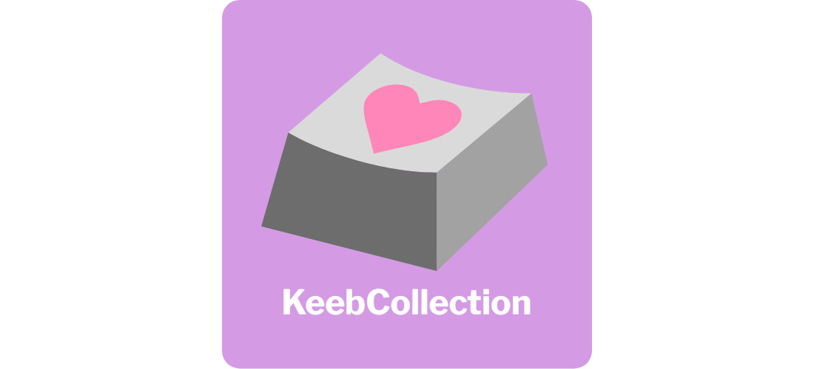
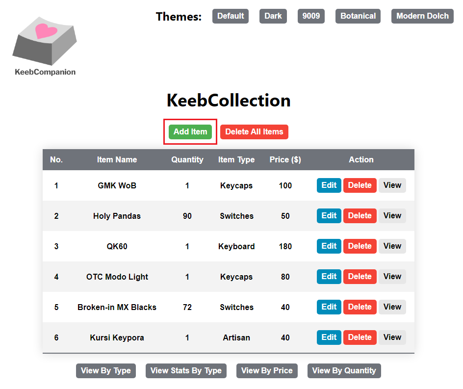
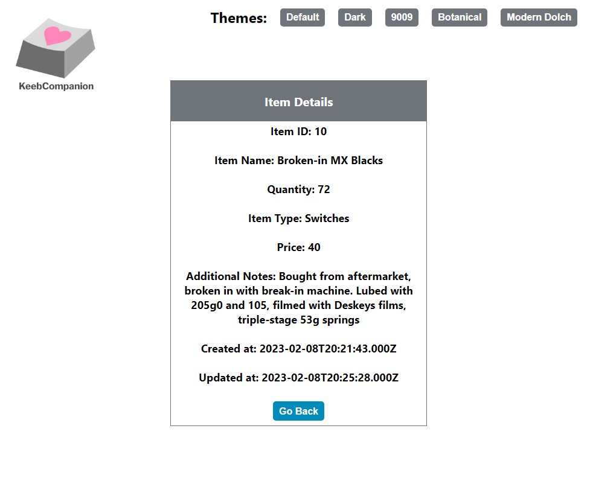
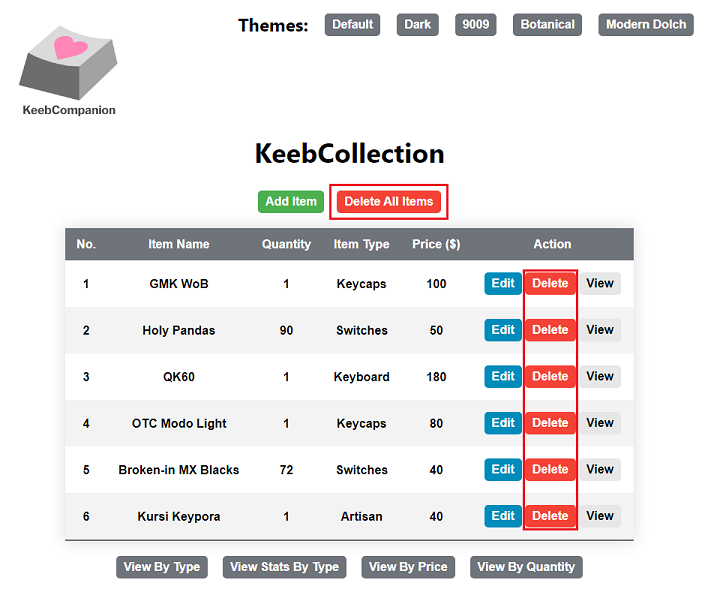

# KeebCollection

<p>
  
</p>

## Description:

KeebCollection is a CRUD web application that allows users to manage their items related to mechanical keyboards. The application also provides users with statistics corresponding to their items as well as the option to sort the items by various parameters.

## Features:

### 1. CRUD Operations

#### 1.1. Create

- Users can create a new item by adding the item to their collection using the 'Add Item' button on the home page of the application.



- Pressing this button will redirect the user to a page where they can provide the following information regarding the item:
  - Required Fields:
    - Item Name; text value
    - Quantity; numerical value
    - Item Type; value of: 'Keyboard', 'Switches', 'Keycaps', 'Artisan', or 'Other'
    - Price; numerical value
  - Optional Fields:
    - Additional Notes; text value


- Users can create their item with their input information by pressing the 'Save' button, or cancel the creation by pressing the 'Go Back' button.
  - After pressing either button, the user will be redirected back to the home page of the application.

<!-- add gif of demo here -->

#### 1.2. Read

- Users can read an item in their collection by selecting the 'View' action for the row corresponding to the item.
  - Users can also perform a read operation by using one of the additional view buttons located below the table on the home page. More details on the this can be found in the [Additional Views](#2-additional-views) section.


- Pressing this button will redirect the user to a page where they can view all of the information corresponding to the created item.
  - In addition to the information displayed on the home page, this page will also display the following values:
    - Additional Information; optional text provided as input by the user during creation
    - Created at; timestamp of the date and time that the item was created
    - Updated at; timestamp of the date and time that the item was last updated



- Users will be redirected to the page prior to pressing the 'View' button by pressing the 'Go Back' button.

<!-- add gif of demo here -->

#### 1.3. Update

- Users can update an item in their collection by selecting the 'Edit' action for the row corresponding to the item.


- Pressing this button will redirect the user to a page similar to that of the 'Add Item' page with the existing values for the row pre-filled.


- Users can update their item with their input information by pressing the 'Save' button, or cancel the update by pressing the 'Go Back' button.
  - After pressing either button, the user will be redirected back to the home page of the application.

<!-- add gif of demo here -->

#### 1.4. Delete

- Users can delete a single item from their collection by selecting the 'Delete' action for the row corresponding to the item.
- Users can also delete all of the items for their collection by pressing the 'Delete All Items' button.



- Pressing either of these buttons will not redirect users to a new page, but rather they will receive a prompt from their web browser confirming the deletion before performing the operation.

<!-- add gif of demo here -->

### 2. Additional Views

The following are various read operations for users to view their collection with.

#### 2.1 View By Type

- description of view
- picture of button location
- description of redirected page
- picture of redirected page
- description on return

<!-- add gif of demo here -->

#### 2.2. View Stats By Type

- description of view
- picture of button location
- description of redirected page
- picture of redirected page
- description on return

<!-- add gif of demo here -->

#### 2.3. View By Price

- description of view
- picture of button location
- description of redirected page
- picture of redirected page
- description on return

<!-- add gif of demo here -->

#### 2.4. View By Quantity

- description of view
- picture of button location
- description of redirected page
- picture of redirected page
- description on return

<!-- add gif of demo here -->

### 3. Changing the Application Theme

- description of themes
- description on button locations
- gif cycling through themes

<!-- add gif of demo here -->

## Setup:

- list initial setup here
- list steps to run the app afterwards here
- list steps to exit the app here

## How to Run the Application:

1. **Before running the application, please ensure that you have completed the following:**

   - The 'Setup' section of the main README located <a href="https://github.com/jal004/KeebCompanion#setup-creating-a-local-connection-in-mysql-workbench" target="_blank">here</a>
   - The 'Setup' section of this individual README located [here](#setup)

2. Launching a web application requires executing both the server and client side files.

   - This is typically done by launching two terminal shells and executing the server and client side files in each of them respectively.
   - `start-app` is a script that uses the Node package `concurrently` to run the server and client side files in parallel within a single terminal shell.

     - This allows for users to easily run and exit the app with a single command
     - For more details on the script, view the `package.json` file in the `KeebCollection` directory

   - **To run the application**, open a terminal in your desired text editor, navigate to the `KeebCollection` directory and run the command:

     ```
     npm run start-app
     ```

     - After running this command, the application will open on your web browser.

3. To exit KeebCollection, execute 'Ctrl+C' in the terminal, then enter 'Y' followed by the 'Enter' key to close the app.

## Known Issues:

1. 'Item Type' field selection is not being saved when editing an existing item
   - This does not affect update functionality, but it can be inconvenient having to reselect the item type every time an item is updated.
2. KeebCompanion logo is not matching the saved application theme when relaunching
   - This is because the default logo corresponds to the light theme.
   - After relaunching, reselecting the saved theme will fix the logo so that it matches the theme again.
   - Future plans are to convert the logos from PNG to SVG so that we can modify the colors with CSS instead of changing the picture on a theme change.
