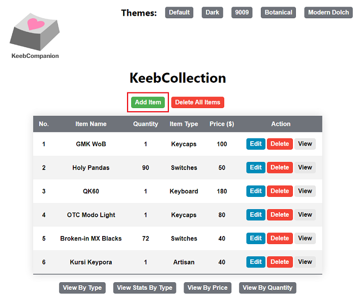
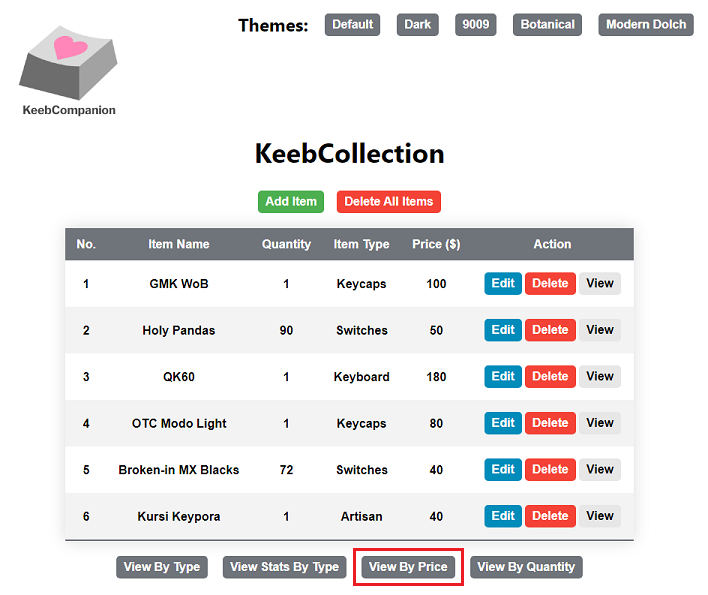
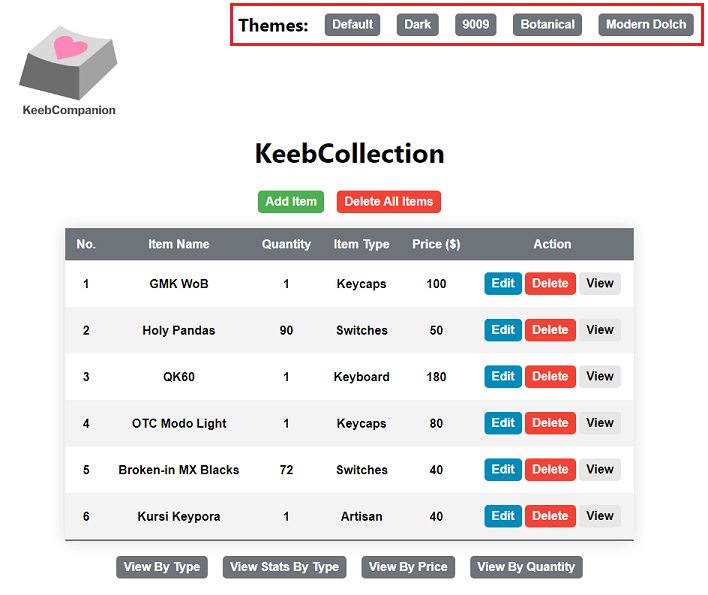

# KeebCollection

<p>
  
</p>

## Description:

KeebCollection is a CRUD web application that allows users to manage their items related to mechanical keyboards. The application also provides users with statistics corresponding to their items as well as the option to sort the items by various parameters.

## Features:

### 1. CRUD Operations

#### 1.1. Create

- Users can create a new item by adding the item to their collection using the 'Add Item' button on the home page of the application.



- Pressing this button will redirect the user to a page where they can provide the following information regarding the item:
  - Required Fields:
    - Item Name; text value
    - Quantity; numerical value
    - Item Type; value of: 'Keyboard', 'Switches', 'Keycaps', 'Artisan', or 'Other'
    - Price; numerical value
  - Optional Fields:
    - Additional Notes; text value


- Users can create their item with their input information by pressing the 'Save' button, or cancel the creation by pressing the 'Go Back' button.
  - After pressing either button, the user will be redirected back to the home page of the application.

#### 1.2. Read

- Users can read an item in their collection by selecting the 'View' action for the row corresponding to the item.
  - Users can also perform a read operation by using one of the additional view buttons located below the table on the home page. More details on the this can be found in the [Additional Views](#2-additional-views) section.


- Pressing this button will redirect the user to a page where they can view all of the information corresponding to the created item.
  - In addition to the information displayed on the home page, this page will also display the following values:
    - Additional Information; optional text provided as input by the user during creation
    - Created at; timestamp of the date and time that the item was created
    - Updated at; timestamp of the date and time that the item was last updated


- Users will be redirected to the page prior to pressing the 'View' button by pressing the 'Go Back' button.

#### 1.3. Update

- Users can update an item in their collection by selecting the 'Edit' action for the row corresponding to the item.


- Pressing this button will redirect the user to a page similar to that of the 'Add Item' page with the existing values for the row pre-filled.


- Users can update their item with their input information by pressing the 'Save' button, or cancel the update by pressing the 'Go Back' button.
  - After pressing either button, the user will be redirected back to the home page of the application.

#### 1.4. Delete

- Users can delete a single item from their collection by selecting the 'Delete' action for the row corresponding to the item.
- Users can also delete all of the items for their collection by pressing the 'Delete All Items' button.


- Pressing either of these buttons will not redirect users to a new page, but rather they will receive a prompt from their web browser confirming the deletion before performing the operation.

### 2. Additional Views

The following are various read operations for users to view their collection with.

#### 2.1 View By Type

- Users can view the items in their collection grouped by the type of the item specified by the 'Item Type' column value by pressing the 'View By Type' button.
  - The groups of the items are displayed in alphabetical order. This means that the order of groups displayed is: Artisan, Keyboard, Keycaps, Other, Switches.
  - Items of the same type are sorted in descending order of price.


- Pressing this button will redirect the user to a page that displays the items in their collection grouped by their item type.


- Users can view each of their items on this page by pressing the 'View' button corresponding to an item.

  - This button will redirect the user to the same page as the read operation described in the 'CRUD Operations' section [above.](#12-read)
  - Since the 'Go Back' button on this page returns the user back to the page prior to pressing the view button, the user will be redirected back to the 'View By Type' page rather than the home page.

- Users can return to the previous page by pressing the 'Go Back To Home' button.

#### 2.2. View Stats By Type

- Users can statistics for the items in their collection grouped by the type of the item specified by the 'Item Type' column value by pressing the 'View Stats By Type' button.
  - The groups of the items are displayed in alphabetical order. This means that the order of groups displayed is: Artisan, Keyboard, Keycaps, Other, Switches.


- Pressing this button will redirect the user to a page with two tables that display statistical values that pertain to two parameters:

  a. Price Statistics

  - Minimum (Min.) Price; minimum price of an item of the item type
  - Maximum (Max.) Price; maximum price of an item of the item type
  - Average (Avg.) Price; average price of an item of the item type
  - Total Price; total price of the items of the item type
  - Price Percentage of Entire Collection; percentage of the total price of the item type relative to the total price of all items.

  b. Quantity Statistics

  - Minimum (Min.) Quantity; minimum quantity of an item of the item type
  - Maximum (Max.) Quantity; maximum quantity of an item of the item type
  - Average (Avg.) Quantity; average quantity of an item of the item type


- Users can return to the previous page by pressing the 'Go Back To Home' button.

#### 2.3. View By Price

- Users can view the items in their collection in descending order of price by pressing the 'View By Price' button.
  - Items of the same price are displayed in descending alphabetical order.



- Users can view each of their items on this page by pressing the 'View' button corresponding to an item.
  - This button will redirect the user to the same page as the read operation described in the 'CRUD Operations' section [above.](#12-read)
  - Since the 'Go Back' button on this page returns the user back to the page prior to pressing the view button, the user will be redirected back to the 'View By Price' page rather than the home page.


- Users can return to the previous page by pressing the 'Go Back To Home' button.

#### 2.4. View By Quantity

- Users can view the items in their collection in descending order of quantity by pressing the 'View By Quantity' button.
  - Items of the same quantity are displayed in descending order of price.


- Users can view each of their items on this page by pressing the 'View' button corresponding to an item.
  - This button will redirect the user to the same page as the read operation described in the 'CRUD Operations' section [above.](#12-read)
  - Since the 'Go Back' button on this page returns the user back to the page prior to pressing the view button, the user will be redirected back to the 'View By Quantity' page rather than the home page.


- Users can return to the previous page by pressing the 'Go Back To Home' button.

### 3. Changing the Application Theme

- Users can change the color scheme of the application by selecting one of the theme buttons located at the top-right corner.



- The themes that users can select from include:
  - Default; light color scheme
  - Dark; 'Default' theme with inverted background color, inverted text colors, and darker buttons
  - 9009; retro color scheme inspired by the keycaps on the classical [Cherry G80-9009 keyboard](https://deskthority.net/wiki/Cherry_G80-9009)
  - Botanical; nature color scheme inspired by the keycap set [GMK Botanical](https://geekhack.org/index.php?topic=104954.0)
  - Modern Dolch; grayscale color scheme inspired by the keycap set [GMK Modern Dolch](https://geekhack.org/index.php?topic=106764.0)


- The theme that a user selects will be saved when relaunching the application in the future.

## Setup:

- **Before performing this setup, please ensure that you have completed the 'Setup' section of the main README located <a href="https://github.com/jal004/KeebCompanion#setup-creating-a-local-connection-in-mysql-workbench" target="_blank">here</a>**

1. Open the KeebCollection directory in your desired text editor
2. Find the `index.js` file in the `server` directory and open this file in the text editor.
   - The absolute path to this file from the repository folder is:
     ```
     /KeebCompanion/KeebCollection/server/index.js
     ```
3. Locate the following body of text _(Highlighted in red below)_ in `index.js`:


4. Change the following values _(Highlighted in green above)_ in this body of text:

   - The value corresponding to `user` ("local_user") to "root"
   - The value corresponding to `password` ("password") to the password that you created in the 'Setup' section of the main README wrapped in double-quotes.
   - The text should now look like the following, with your created password replacing
     `<your password here>`:
     ```
     var db = mysql.createConnection({
       host: "localhost",
       user: "root",
       password: "<your password here>",
     });
     ```

5. Save and close `index.js`
   - We have successfully connected our local MySQL connection to the KeebCollection web application.

## How to Run the Application:

- **Before running the application, please ensure that you have completed the 'Setup' section of this README located [here](#setup)**

1. Launching a web application requires executing both the server and client side files.

   - This is typically done by launching two terminal shells and executing the server and client side files in each of them respectively.
   - `start-app` is a script that uses the Node package `concurrently` to run the server and client side files in parallel within a single terminal shell.

     - This allows for users to easily run and exit the app with a single command
     - For more details on the script, view the `package.json` file in the `KeebCollection` directory [here](https://github.com/jal004/KeebCompanion/blob/main/KeebCollection/package.json)

   - **To run the application**, open a terminal in your desired text editor, navigate to the `KeebCollection` directory and run the command:

     ```
     npm run start-app
     ```

     - After running this command, the application will open on your web browser.

2. To exit KeebCollection, execute 'Ctrl+C' in the terminal, then enter 'Y' followed by the 'Enter' key to close the application.

## Known Issues:

1. The 'Item Type' field selection is not being saved when editing an existing item
   - This does not affect update functionality, but it can be inconvenient having to reselect the item type every time an item is updated.
2. The KeebCompanion logo is not matching the saved application theme when relaunching
   - This is because the default logo corresponds to the light theme.
   - After relaunching, reselecting the saved theme will fix the logo so that it matches the theme again.
   - Future plans are to convert the logos from PNG to SVG so that we can modify the colors with CSS instead of changing the picture on a theme change.
