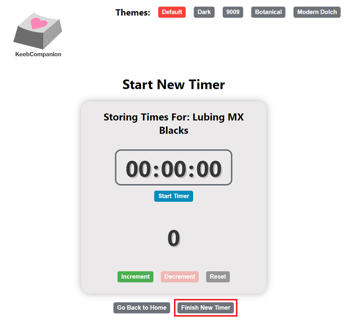

# KeebTimer

<p>
  
</p>

## Table of Contents:

- [KeebTimer](#keebtimer)
  - [Table of Contents:](#table-of-contents)
  - [Description:](#description)
  - [Features:](#features)
    - [1. Create New Timer](#1-create-new-timer)
      - [1.1 Start/Stop Timer](#11-startstop-timer)
      - [1.2. Increment Counter](#12-increment-counter)
      - [1.3. Decrement Counter](#13-decrement-counter)
      - [1.4. Reset Counter](#14-reset-counter)
      - [1.5. Finish New Timer](#15-finish-new-timer)
    - [2. View Saved Times](#2-view-saved-times)
      - [2.1. Update Timer](#21-update-timer)
      - [2.2. Delete Timer](#22-delete-timer)
      - [2.3. View Timer](#23-view-timer)
    - [3. Changing the Application Theme](#3-changing-the-application-theme)
  - [Setup:](#setup)
  - [How to Run the Application:](#how-to-run-the-application)
  - [Known Issues:](#known-issues)

## Description:

KeebTimer is a CRUD application that allows users to store and analyze their time spent performing mechanical keyboard related activities. Many of the tasks related to mechanical keyboards are largely repetitive often take several hours to complete. These tasks typically involve performing the same procedure(s) many times. Some common examples include lubricating switches, soldering/desoldering switches, and inserting Mill-Max sockets into a keyboard PCB.

The goal of KeebTimer is to reduce fatigue by providing users with insight on the amount of time spent while performing these tasks.

## Features:

### 1. Create New Timer

- Users can create a new timer using the 'Start New Timer' button on the home page of the application.


- Pressing this button will prompt the user with an input field for entering the name of the timer to be created.


- Upon entering a valid name for the timer, the user will be redirected to a page with a timer and counter for that name.
  - A valid name is defined as a name that is non-empty, does not consist of purely whitespace, and does not exceed 50 characters.


#### 1.1 Start/Stop Timer

- On the timer page, users can start the timer by pressing the 'Start Timer' button.
  - The button switches between 'Start Timer' and 'Stop Timer' with their respective functionalities when pressed.
- The units of the timer are HH:MM:SS, where H, M, and S denote the digits of the hours, minutes, and seconds respectively.
- The timer increases by one second for each second that the timer is running.


#### 1.2. Increment Counter

- On the timer page, users can increase the counter by one by pressing the 'Increment' button.
- This button will store a lap for the timer at the time that the button was pressed which users can view later.


#### 1.3. Decrement Counter

- On the timer page, users can decrease the counter by one by pressing the 'Decrement' button.
  - When the counter is at zero, this button is grayed out and disabled to prevent users from decreasing the counter below zero.
- This button will remove the most recently added lap for the timer when pressed.


#### 1.4. Reset Counter

- On the timer page, users can reset both the timer and the counter to zero by pressing the 'Reset' button.
- This button will remove all of the laps for the timer when pressed.


#### 1.5. Finish New Timer

- On the timer page, users can save the timer by pressing the 'Finish New Timer' button.



- Pressing this button will redirect the user to a confirmation page to view the name, total time, and count values to be saved and provide any additional notes.
  - When creating a new timer, users will only be able to add additional notes; they will not be able to change the name, total time, or count values.


- Users can save the timer by pressing the 'Save Timer' button, or continue using the time by pressing the 'Go Back' button.
  - When the user returns back to the timer with the 'Go Back' button, the time and count values for the timer before pressing the 'Finish New Timer' button will be retained.

### 2. View Saved Times

- Users can access saved timers using the 'View Saved Times' button on the home page of the application.


- Pressing this button will redirect the user to a page consisting of a table of saved timers and the possible CRUD operations for each timer.


#### 2.1. Update Timer

- Users can continue updating an existing timer by pressing the 'Edit' action for the row corresponding to the timer.


- Pressing this button will redirect the user to a page similar to that of the 'Start New Timer' page with the existing values for the timer pre-filled.


- Users can submit changes made to the existing timer by pressing the 'Finish Existing Timer' button.


- This will redirect the user to a confirmation page similar to that of 'Finish New Timer', but also allows the user to change the name of the existing timer.


- Users can update the timer by pressing the 'Update Timer' button, or continue using the time by pressing the 'Go Back' button.
  - When the user returns back to the timer with the 'Go Back' button, the time and count values for the timer before pressing the 'Finish Existing Timer' button will be retained.

#### 2.2. Delete Timer

- Users can delete a single timer by selecting the 'Delete' action for the row corresponding to the timer.
- Users can also delete all of the timers by pressing the 'Delete All Times' button.


- Pressing either of these buttons will prompt a confirmation message that the user must confirm for a deletion to occur.

#### 2.3. View Timer

- Users can view information for a timer by pressing the 'Edit' action of the row corresponding to the timer.


- Pressing this button will redirect the user to a page where they can view all of the information for the timer from its confirmation page prior to submission.


- On this page, users can view additional information for the timer by pressing the 'More Details' button.


- Pressing this button will redirect the user to a page that displays statistics for between each lap as well as the lap data itself.


- When the lap data increases to the point where scrolling is required to view all of the laps, the 'Go Back To Top' button will appear at the bottom of the page for users to scroll back to the top when pressed.


### 3. Changing the Application Theme

- Users can change the color scheme of the application by selecting one of the theme buttons located at the top-right corner.


- The themes that users can select from include:
  - Default; light color scheme
  - Dark; 'Default' theme with inverted background color, inverted text colors, and darker buttons
  - 9009; retro color scheme inspired by the keycaps on the classical [Cherry G80-9009 keyboard](https://deskthority.net/wiki/Cherry_G80-9009)
  - Botanical; nature color scheme inspired by the keycap set [GMK Botanical](https://geekhack.org/index.php?topic=104954.0)
  - Modern Dolch; grayscale color scheme inspired by the keycap set [GMK Modern Dolch](https://geekhack.org/index.php?topic=106764.0)


- The theme that a user selects will be saved when relaunching the application in the future.

## Setup:

- **Before performing this setup, please ensure that you have completed the 'Setup' section of the main README located <a href="https://github.com/jal004/KeebCompanion#setup-creating-a-local-connection-in-mysql-workbench" target="_blank">here</a>**

1. Open the KeebTimer directory in your desired text editor
2. Find the `index.js` file in the `server` directory and open this file in the text editor.
   - The absolute path to this file from the repository folder is:
     ```
     /KeebCompanion/KeebTimer/server/index.js
     ```
3. Locate the following body of text in `index.js` _(Highlighted in red below)_:


4. Change the following values in this body of text _(Highlighted in green above)_:

   - The value corresponding to `user` ("local_user") to "root"
   - The value corresponding to `password` ("password") to the password that you created in the 'Setup' section of the main README wrapped in double-quotes.
   - The text should now look like the following, replacing `<your password here>` with your created password:
     ```
     var db = mysql.createConnection({
       host: "localhost",
       user: "root",
       password: "<your password here>",
     });
     ```

5. Save and close `index.js`
   - We have successfully connected our local MySQL connection to the KeebTimer web application.

## How to Run the Application:

- **Before running the application, please ensure that you have completed the 'Setup' section of this README located [here](#setup)**

1. Launching a web application requires executing both the server and client side files.

   - This is typically done by launching two terminal shells and executing the server and client side files in each of them respectively.
   - `start-app` is a script that uses the Node package `concurrently` to run the server and client side files in parallel within a single terminal shell.

     - This allows for users to easily run and exit the app with a single command
     - For more details on the script, view the `package.json` file in the `KeebCollection` directory [here](https://github.com/jal004/KeebCompanion/blob/main/KeebCollection/package.json)

   - **To run the application**, open a terminal in your desired text editor, navigate to the `KeebTimer` directory and run the command:

     ```
     npm run start-app
     ```

     - After running this command, the application will open on your web browser.

2. To exit KeebTimer, execute 'Ctrl+C' in the terminal, then enter 'Y' followed by the 'Enter' key to close the application.

## Known Issues:

1. The KeebCompanion logo is not matching the saved application theme when relaunching

   - This is because the default logo corresponds to the light theme.
   - After relaunching, reselecting the saved theme will fix the logo so that it matches the theme again.
   - Future plans are to convert the logos from PNG to SVG so that we can modify the colors with CSS instead of changing the picture on a theme change.
   - This is a problem that is also present in KeebCollection because it uses the same implementation.

2. It is possible for the data of a timer and its lap data to be mismatched
