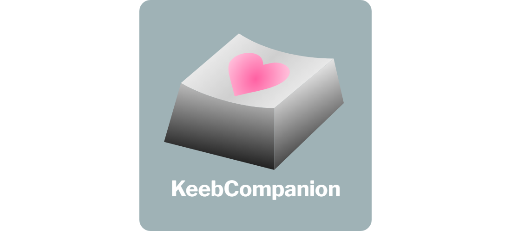
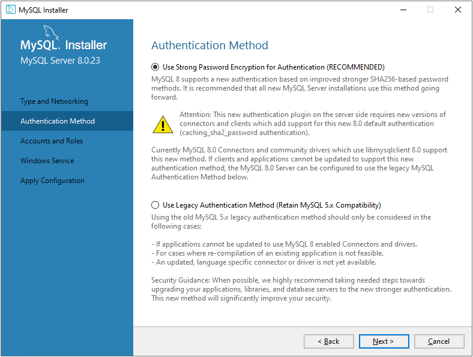
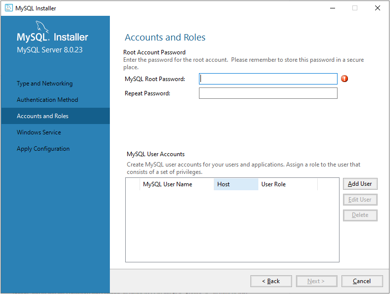
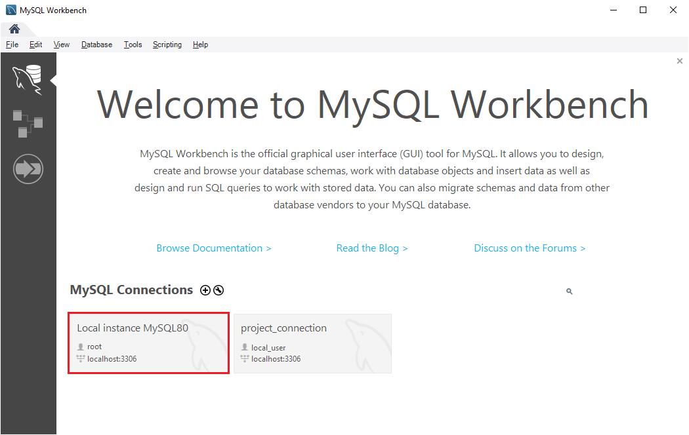

# KeebCompanion

<p>
  
</p>

## Background:

Are you a mechanical keyboard enthusiast that has trouble managing their collection? Do you have trouble managing all of your purchases or sales? Or do you just wish that there were more tools that specifically support this hobby? If any of these apply to you, then look no further!

Introducing KeebCompanion, a collection of four web applications that can be used by mechanical keyboard enthusiasts and those that plan on entering the hobby. Below are brief descriptions of the four tools.

## The Web Applications:

For additional information on each of the web applications, please navigate to their respective folders in the GitHub repository

### 1. KeebCollection

<figure style="display: block; margin: 0 auto; width: 75%; margin-bottom: 30px"> 
  
  <!-- <figcaption style="text-align: center; font-style: italic">KeebCollection Home Page</figcaption> -->
</figure>

- A mechanical keyboard collection manager that allows users to create, read, update, and delete (CRUD) items to or from a table.
- The application allows users to view the table sorted by specific parameters (price, item type, quantity).
- Users can also view statistics for the items in the table.
- <a href="https://github.com/jal004/KeebCompanion/tree/main/KeebCollection" target="_blank">Additional Information</a>

### 2. KeebSales

- preview of app here
- description of app here
- additional info (link to folder in repo)

### 3. KeebieGeebies

- preview of app here
- description of app here
- additional info (link to folder in repo)

### 4. KeebTimer

- preview of app here
- description of app here
- additional info (link to folder in repo)

## System Requirements:

### 1. Minimum hardware requirements for ReactJS

- Windows XP, Windows 7 or higher
- 4 GB of RAM or higher
- 10 GB of hard disk space

### 2. Installation of NodeJS

- <a href="https://nodejs.org/en/download/" target="_blank">Node Website</a>

### 3. Installation of MySQL Workbench

- <a href="https://www.mysql.com/products/workbench/" target="_blank">MySQL Workbench Website</a>

## Setup: Creating a Local Connection in MySQL Workbench

- Since each of the tools in KeebCompanion uses MySQL to store user information, we need to create a local connection in MySQL Workbench that we can connect each of the web applications.
- If you have already installed MySQL Workbench, you will already have a local connection consisting of the 'root' user with a password that you created in the MySQL installer during the installation.
- If this is your first time using MySQL Workbench, you will have to create the 'root' user during the installation.

  - During the installation, select 'Next' on all of the pages of the installer to install MySQL Workbench using the recommended settings.
  - Eventually, you will reach a page that asks if you want to set up a password for the 'root' user.
    Select 'Next' to create the password.

  <figure style="display: block; margin: 0 auto; width: 80%; margin-top: 10px;margin-bottom: 30px"> 
    
    <!-- <figcaption style="text-align: center; font-style: italic">Prompt to Create Password for 'root' in MySQL Installer</figcaption> -->
  </figure>

  - Create the password for 'root' in the following page and continue selecting 'Next' on the remaining pages of MySQL Installer.

  <figure style="display: block; margin: 0 auto; width: 80%; margin-top: 10px; margin-bottom: 30px"> 
    
    <figcaption style="text-align: center; font-style: italic">Page to Create Password for 'root' in MySQL Installer</figcaption>
  </figure>

  - After successfully installing MySQL Workbench, the home page of MySQL Workbench should contain a local connection instance under the user 'root'.
  <figure style="display: block; margin: 0 auto; width: 80%; margin-top: 10px; margin-bottom: 30px"> 
    
    <!-- <figcaption style="text-align: center; font-style: italic">Local Instance for 'root' Highlighted in Red</figcaption> -->
  </figure>

- Keep note of the password created for the 'root' user as we will be using it to connect each of the web applications to this MySQL local instance before running them.

<!-- The following lines below will not be used here, but parts of it can be used in the individual README's -->
<!-- ### 2. Running the Web Applications

- In order to run each of the four web applications:
  1. Clone the repository
  2. Navigate to the directory of the repository
  3. Navigate to the directory of the desired application
  4. Complete the additional setup specified in the README of that directory on GitHub
  5. Run the command:

```
npm run start-app
```

- The absolute paths from the repository folder (KeebCompanion) that we have to navigate to in order to run the command above are:

```
/KeebCompanion/KeebCollection
/KeebCompanion/KeebSales
/KeebCompanion/KeebieGeebies
/KeebCompanion/KeebTimer
``` -->
