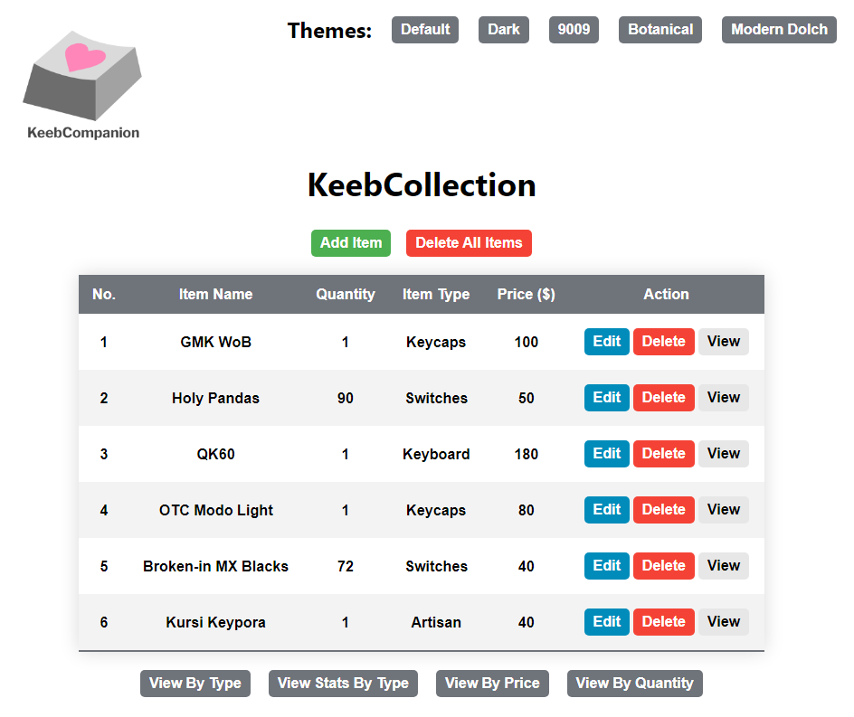

# KeebCompanion

<p>
  
</p>

## Table of Contents:

- [KeebCompanion](#keebcompanion)
  - [Table of Contents:](#table-of-contents)
  - [Background:](#background)
  - [The Web Applications:](#the-web-applications)
    - [1. KeebCollection](#1-keebcollection)
    - [2. KeebSales](#2-keebsales)
    - [3. KeebieGeebies](#3-keebiegeebies)
    - [4. KeebTimer](#4-keebtimer)
  - [System Requirements:](#system-requirements)
    - [1. Minimum hardware requirements for ReactJS](#1-minimum-hardware-requirements-for-reactjs)
    - [2. Installation of NodeJS](#2-installation-of-nodejs)
    - [3. Installation of MySQL Workbench](#3-installation-of-mysql-workbench)
  - [Setup (Creating a Local Connection in MySQL Workbench):](#setup-creating-a-local-connection-in-mysql-workbench)
  - [Running the Web Applications:](#running-the-web-applications)

## Background:

Are you a mechanical keyboard enthusiast that has trouble managing their collection? What about your managing your sales or purchases? Do you wish there were more specialized tools for this hobby? If so, then look no further!

Introducing KeebCompanion, a collection of four web applications that can be used by mechanical keyboard enthusiasts and those that plan on entering the hobby. Below are brief descriptions of the four tools.

## The Web Applications:

For additional information on each of the web applications, please navigate to their respective folders in the GitHub repository

### 1. KeebCollection

<!-- <figure style="display: block; margin: 0 auto; width: 75%; margin-bottom: 30px">
  
  <figcaption style="text-align: center; font-style: italic">KeebCollection Home Page</figcaption>
</figure> -->

- A mechanical keyboard collection manager that allows users to create, read, update, and delete (CRUD) items to, or from a table.
- The application allows users to view the table sorted by specific parameters (price, item type, quantity).
- Users can also view statistics for the items in the table.
- <a href="https://github.com/jal004/KeebCompanion/tree/main/KeebCollection" target="_blank">Additional Information</a>

### 2. KeebSales

- preview of app here
- description of app here
- additional info (link to folder in repo)

### 3. KeebieGeebies

- preview of app here
- description of app here
- additional info (link to folder in repo)

### 4. KeebTimer

- preview of app here
- description of app here
- additional info (link to folder in repo)

## System Requirements:

### 1. Minimum hardware requirements for ReactJS

- Windows XP, Windows 7 or higher
- 4 GB of RAM or higher
- 10 GB of hard disk space

### 2. Installation of NodeJS

- <a href="https://nodejs.org/en/download/" target="_blank">Node Installation</a>

### 3. Installation of MySQL Workbench

- <a href="https://www.mysql.com/products/workbench/" target="_blank">MySQL Workbench Installation</a>

## Setup (Creating a Local Connection in MySQL Workbench):

- Since each of the tools in KeebCompanion uses MySQL to store user information, we need to create a local connection in MySQL Workbench that we can connect each of the web applications.
- If you have already installed MySQL Workbench, you will already have a local connection consisting of the 'root' user with a password that you created in the MySQL installer during the installation.
  **This means that you have completed the setup and can move on to the next section, keeping note of the password associated with the 'root' user.**
- If this is your first time using MySQL Workbench, you will have to create the 'root' user during the installation.

  - During the installation, select 'Next' on all of the pages of the installer to install MySQL Workbench using the recommended settings.
  - Eventually, you will reach a page that asks if you want to set up a password for the 'root' user.
    Select 'Next' to create the password.

  <figure style="display: block; margin: 0 auto; width: 80%; margin-top: 10px;margin-bottom: 30px"> 
    
    <!-- <figcaption style="text-align: center; font-style: italic">Prompt to Create Password for 'root' in MySQL Installer</figcaption> -->
  </figure>

  - Create the password for 'root' in the following page and continue selecting 'Next' on the remaining pages of MySQL Installer.

  <figure style="display: block; margin: 0 auto; width: 80%; margin-top: 10px; margin-bottom: 30px"> 
    
    <!-- <figcaption style="text-align: center; font-style: italic">Page to Create Password for 'root' in MySQL Installer</figcaption> -->
  </figure>

  - After successfully installing MySQL Workbench, the home page of MySQL Workbench should contain a local connection instance under the user 'root' _(Highlighted in red below)_.
  <figure style="display: block; margin: 0 auto; width: 80%; margin-top: 10px; margin-bottom: 30px"> 
    
    <!-- <figcaption style="text-align: center; font-style: italic">Local Instance for 'root' Highlighted in Red</figcaption> -->
  </figure>

  - **Keep note of the password created for the 'root' user as we will be using it to connect each of the web applications to this MySQL local instance before running them.**

## Running the Web Applications:

After cloning the repository:

1. Open the directory of the repository and a terminal on your desired text editor.
2. Using your terminal, navigate to the directory of the application that you would like to run.
   - The absolute paths to each of the four application directories are from the repository directory are:
     ```
     /KeebCompanion/KeebCollection
     /KeebCompanion/KeebSales
     /KeebCompanion/KeebieGeebies
     /KeebCompanion/KeebTimer
     ```
3. Then, find the directory corresponding to the desired application on GitHub and follow the provided 'Setup' section on the README of that directory in order to connect MySQL to the application.
   - This step is only required for the first usage of each application; every future use will not require this.
4. Run the following command from your terminal in the directory of the desired application to start that application:
   ```
   npm run start-app
   ```
5. To exit any of the apps, execute 'Ctrl+C' in your terminal, then enter 'Y' followed by the 'Enter' key to close the app.
